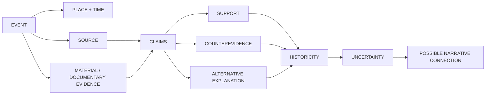

<div align="center">


# LEGEND

## WHERE REALITY BECOMES STORY

### **TRACE THE EVENT.**

#### EVIDENCE · HISTORY · UNCERTAINTY · CONTEXT

A provenance-first **Historical & Event Intelligence** repository for reconstructing real-world events, material evidence, documentary attestation, uncertainty, and defensible links to later narratives.

**MOONWITNESS · ROCKSOUL RESEARCH · STORY × EVENT × PERSON × RGBL × AWS**

<br/>

[](https://github.com/bjo163/rocksoul-legend/actions/workflows/validate.yml)


<br/>

[Architecture](#event-intelligence-graph) · [Canonical cases](#canonical-event-set) · [Shared proof](#four-way-proof-case) · [Documentation](#documentation) · [Assets](https://github.com/bjo163/rocksoul-assets) · [Console](https://github.com/bjo163/rocksoul-crayon)

</div>

---

> **LEGEND starts with evidence of an event—not with the assumption that a story is historically true.**

A source can attest an event without proving every detail.  
A witness can be close without being infallible.  
A narrative can resemble an event without proving origin.  
A text can correspond to history without proving supernatural fulfillment.  
A later interpretation is not the event itself.

That separation is the foundation of LEGEND.

## Visual + console boundary

<div align="center">


</div>

- **`rocksoul-assets`** owns the visual language, shared application-shell references, icons, dashboard components, data-viz, states, and motion.
- **`rocksoul-crayon`** is the operational console that exposes LEGEND through shared AutoMenu / resource navigation.
- **LEGEND remains canonical owner of EVENT data and event semantics.**

## Core question

```text
WHAT happened?
WHEN?
WHERE?
WHAT evidence survives?
WHAT sources attest it?
HOW certain are we?
WHAT alternative explanations exist?
IS there a defensible connection to a later narrative?
```

## Golden rule

### **CORRELATION ≠ ORIGIN**

A historical event plus a similar narrative does not prove that the event caused the narrative.

## Event intelligence graph



<div align="center">

### **EVENT ≠ INTERPRETATION**

</div>

## MoonWitness / Rocksoul research map

| Repository | Layer | Core question / role |
|---|---|---|
| [`rocksoul-assets`](https://github.com/bjo163/rocksoul-assets) | DESIGN | How should the ecosystem look? |
| [`rocksoul-crayon`](https://github.com/bjo163/rocksoul-crayon) | CONSOLE | How do operators work across it? |
| [`rocksoul-mftl`](https://github.com/bjo163/rocksoul-mftl) | STORY | What was told? |
| **`rocksoul-legend`** | EVENT | What happened? |
| [`rocksoul-superhero`](https://github.com/bjo163/rocksoul-superhero) | PERSON | Who was involved? |
| [`rocksoul-rgbl`](https://github.com/bjo163/rocksoul-rgbl) | TEXT | What does the exact text say? |
| [`rocksoul-aws`](https://github.com/bjo163/rocksoul-aws) | LAW | Was it allowed? |

```text
DESIGN  → ASSETS
CONSOLE → CRAYON
STORY   → MFTL
EVENT   → LEGEND
PERSON  → SUPERHERO
TEXT    → RGBL
LAW     → AWS
```

**LEGEND owns canonical EVENT records.** Shared primitives such as sources, claims, evidence, places, artifacts, and relationships remain interoperable concepts rather than separate domains.

[Read the interoperability contract →](docs/INTEROP.md)

## Four-way proof case

### **CASE 001 — JERUSALEM 70 CE**

```text
RGBL TEXT: Mark 13:2
        ↓
MFTL STORY: temple-destruction prediction
        ↓
LEGEND EVENT: Jerusalem / Second Temple, 70 CE
        ↑
SUPERHERO PERSON: Flavius Josephus
```

LEGEND contributes only the independently evidenced **historical event**. It does not convert textual correspondence into a theological-fulfillment verdict.

[Read the shared case →](docs/cases/JERUSALEM-70-TEMPLE.md)

## Canonical event set

LEGEND's foundation has been tested across multiple evidence patterns:

| Case | Event class | Evidence pattern | Result |
|---|---|---|---|
| **Guatavita** | ritual event | archaeology + artifact + colonial text | canonical, explicit counterevidence |
| **Krakatau 1883** | natural disaster | geology + tsunami + institutional record | canonical |
| **Halley 1066** | astronomical event | astronomy + museum/documentary record | canonical |
| **Jerusalem 70 CE** | war/conflict | near-contemporary history + museum synthesis + text comparison | canonical, four-way integration |

Current canonical graph:

```text
4 events
4 places
1 artifact
15 sources
19 claims
21 evidence edges
4 relationships
```

The validator checks both **JSON shape** and **semantic graph references**. Missing local sources, claims, evidence, places, artifacts, or broken local relationship endpoints fail CI.

## First canonical event

### `EVT-COL-GUATAVITA-OFFERINGS`

**Pre-contact Muisca ritual offering activity at Lake Guatavita**

```text
LAKE GUATAVITA
      ↓
ARCHAEOLOGICAL SHRINE EVIDENCE
      ↓
SMALL-SCALE RITUAL OFFERINGS        strongly supported
      │
      ├── COLONIAL GRAND CEREMONY   disputed
      │         ↕
      │    textual support
      │    archaeological counterevidence
      │
      ├── PASCA MUISCA RAFT         contextual artifact
      │
      └── EL DORADO                 historically associated
                                    ≠ proven single origin
```

The important result is not a yes/no verdict: **archaeology supports ritual offering activity, while the spectacular investiture narrative remains separately modeled as disputed.**

## Research principles

**EVIDENCE BEFORE INTERPRETATION.**  
**CORRELATION IS NOT CAUSATION.**  
**SIMILARITY IS NOT TRANSMISSION.**  
**LATER SOURCE IS NOT CONTEMPORARY EVIDENCE.**  
**TRADITION IS EVIDENCE OF TRADITION, NOT AUTOMATIC EVIDENCE OF THE EVENT.**  
**UNCERTAINTY IS DATA.**

## Repository atlas

```text
rocksoul-legend/
├── data/            canonical events + graph objects
├── docs/            method, interoperability, cases, roadmap
├── schemas/         machine-valid contracts
├── scripts/         validation and integrity checks
└── .github/         CI and repository automation
```

## Documentation

| Document | Purpose |
|---|---|
| [Documentation Index](docs/INDEX.md) | Entry point to project documentation |
| [Data Model](docs/DATA_MODEL.md) | Event and graph semantics |
| [Interoperability](docs/INTEROP.md) | Cross-repository ownership and references |
| [Research Policy](docs/RESEARCH_POLICY.md) | Evidence, uncertainty, and provenance rules |
| [Roadmap](docs/ROADMAP.md) | Current milestones and bounded next steps |
| [Jerusalem 70 CE](docs/cases/JERUSALEM-70-TEMPLE.md) | Shared four-way proof case |

---

<div align="center">


## **TRACE THE EVENT.**

### **SOURCE · EVIDENCE · HISTORICITY · UNCERTAINTY**

**Reality first. Interpretation second. Provenance always.**

`LEGEND / MoonWitness · Rocksoul Research`

</div>


## Branch model

```text
main  ← stable / release
dev   ← all development
```

Development lands in `dev`. Release promotion is only `dev → main`. Noncanonical remote branches are removed automatically by the branch-policy workflow.

[Read the branching contract →](docs/BRANCHING.md)
